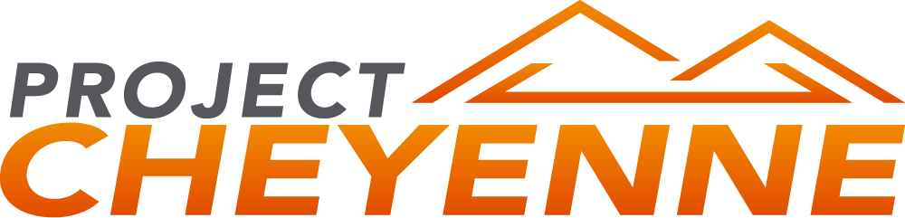
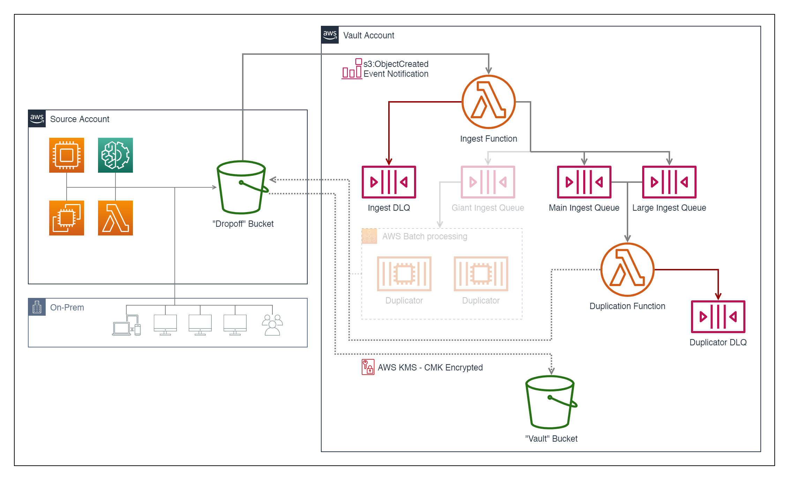

## what is Cheyenne?

Cheyenne is a minimalist approach to providing immutable, automated storage using native AWS Serverless technologies such as AWS Lambda, AWS SQS, and AWS S3.  By utilizing a number of native AWS capabilities, Cheyenne establishes a one-way valve for your data to be pulled into its Vault, protecting that data with immutable AWS S3 Object Lock configrations to provide safe and secure WORM storage for your Disaster Recovery needs.

Cheyenne's primary considerations are:

- Security
- Solution overhead
- Ease of use

### How is this different from AWS Backup?

AWS Backup does not prevent deletion of data stored via AWS Backup.  A properly authenticated attacker can still leverage administrative privileges to destroy data held within AWS Backup as part of a more sophisticated attack against a target.

## license

Cheyenne is licensed under the MIT License; see [`./LICENSE`](./LICENSE) for the full license.

## requirements

* Basic to Intermediate AWS knowledge regarding AWS S3 and use of AWS CloudFormation.
* 1 or more "Source" AWS Accounts. These can be in regular production use as necessary; we will be adding a new AWS S3 Bucket, AWS S3 Bucket Policy, and AWS KMS key used to encrypt content within the newly added Bucket(s).  An existing S3 Bucket can be retrofit to support it if necessary as long as the Bucket Policy and S3 Notification Configuration can be modified.
* 1 "Vault" AWS Account in the same region as your "Source" AWS Accounts. This account should be separate and not permit same domain access, allow access into the account via AWS Orgs, or any other form of SSO. If your main accounts are organized, you DO NOT WANT any direct access into the account. Depending on your threat model, you may want to utilize a separate & isolated network, separate workstation. **We strongly recommend a thorough consideration for protecting your authentication into this account.**

At this time, support for multiple regions within Cheyenne is not available.  We recommend deploying a separate Vault account for each AWS region you wish to support instead.

## installation

See the install documentation [here](./docs/INSTALL.md).

## recovering files from the vault

Log into the Vault with appropriate credentials and perform S3 downloads. Your files, when copied into the Vault, are placed in subkeys derived from the concatenation of the Source bucket's name and the original object key.

To provide a simple example, presume we have a Source bucket named "my-source", and a Vault bucket named "my-vault". Let's assume we uploaded an object such that it could be found at `s3://my-source/my-files/test.zip`.  When this file is copied into the Vault, it would then be placed such that it could be found at `s3://my-vault/my-source/my-files/test.zip`.
As long as you are in possession of account credentials that are permitted `kms:Decrypt` by the `VaultKMSKey` KMS Key Policy and have an IAM Policy attached permitting `s3:GetObject`, you can readily obtain your files in a disaster recovery scenario.

## design

**Cheyenne DOES**:

- assume responsibility for duplicating files into the Vault, ensuring tighter control of Vault access
- permit accounts, once trust is established, to *request* file duplication into the Vault
- duplicate files *immediately* in response to `s3:ObjectCreated` events in your Source buckets
- (re)encrypt your files with an AWS KMS key established specifically for use with the Vault, ensuring that deletion of the original AWS KMS key does not render your data unrecoverable
- prevent your files from being fully overwritten with a compromised version; prior versions are retained for the full Object Protection Duration

**Cheyenne DOES NOT**:

- allow external accounts (such as Source accounts) enumerate files currently present in the Vault
- allow external accounts (such as Source accounts) to arbitrarily write objects into the Vault
- allow objects to be deleted from the Vault during its Object Protection Duration
- **prevent termination of the AWS account via the root account**
