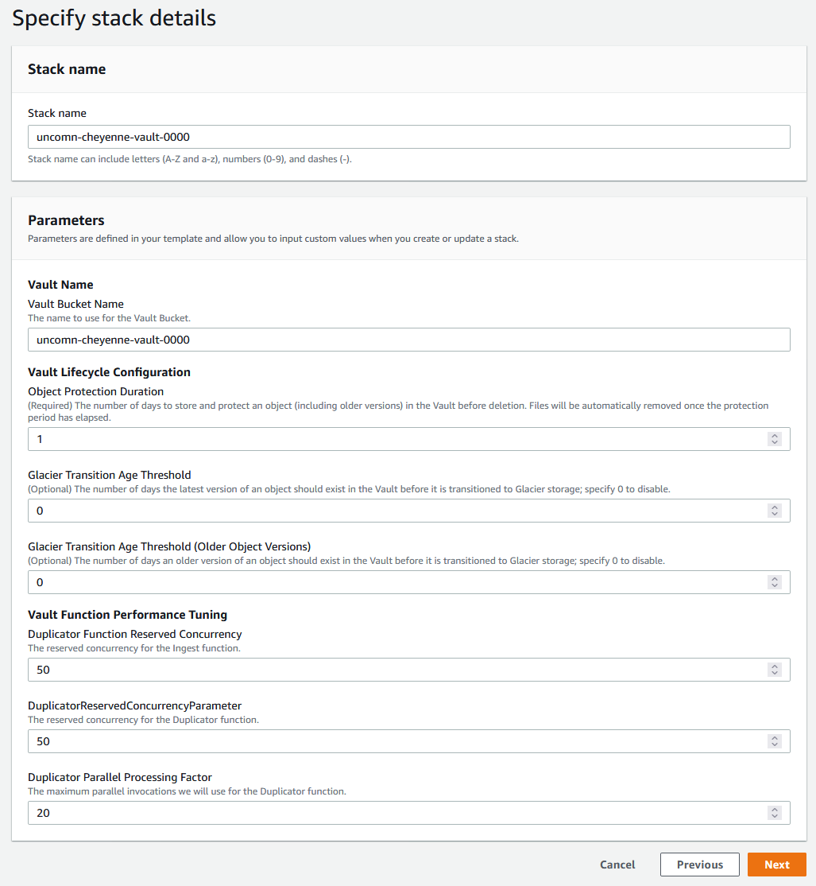

# Cheyenne

## Installation

*Please note: retrofitting a bucket to become an S3 Source Buckets is currently an exercise to the reader.*
We strongly recommend reviewing the `cloudformation/source-bucket.yml` template if attempting to retrofit an existing S3 bucket for use with Cheyenne - most importantly the S3 Notification Configuration and S3 Bucket Policy.

1. Download and locally extract the deployment package from [the latest GitHub Release of Cheyenne](https://github.com/uncomnllc/cheyenne/releases).

2. Audit the AWS CloudFormation templates in `cloudformation/` and the AWS Lambda functions and layers provided in `upload/`.

3. Make any adjustments necessary to the `IngestBucketKey` and `IngestBucketPolicy` resources in `cloudformation/source-bucket.yml` and the `DuplicatorSourcePolicy` resource in `cloudformation/vault-account.yml` to reduce the Resource scope as much as possible for your needs, per [Principle of Least Privilege](https://owasp.org/www-community/Access_Control). We strongly recommend documenting what changes you make (and/or storing the changed and unchanged versions of these templates in a Version Control System such as a Git repository).

4. Log in to your Vault AWS account with Administrator access. You will need the authorization to create S3 Buckets, Lambda functions, Lambda layers, SQS queues, IAM Managed Policies, IAM Roles, CloudFormation stacks, and other resources.  We will be orchestrating the creation of these resources via AWS CloudFormation, but the user or role executing these CloudFormation templates will need the appropriate permissions to manage the resources themselves.

5. Navigate to the AWS CloudFormation Console and create a new CloudFormation Stack.  Under the Specify template section, choose "Upload a template file", and then navigate to the extracted deployment package and upload the file `cloudformation/vault-init.yml`.

Choose an appropriate stack name, then proceed with Stack Creation after setting any other options you deem essential. This template will create a number of AWS CloudFormation exports (used for managing updates to Cheyenne with future deployment packages) and a staging bucket in S3 (used to deploy the Cheyenne Vault).

6. Navigate to the newly created S3 Bucket and upload everything within the `upload/` directory of the extracted deployment package directly to the root of the bucket (such that the boto3 layer can be found at `my-s3-staging-bucket/boto3-layer_python3.8_8e044f9c00.zip`.)

7. Navigate back to the AWS CloudFormation Console and create another new CloudFormation Stack.  This time, upload the `cloudformation/vault-account.yml` template.  Choose an appropriate unique name for your Vault Bucket Name, choose an appropriate Object Protection Duration, along with Glacier Transition thresholds if desired.

**PLEASE NOTE**: the Object Protection Duration will prevent data from being deleted or modified for as many days as is specified, and will prevent the S3 Bucket from being deleted whilst objects remain under protection.  This parameter cannot be changed after stack creation, requiring a full removal and recreation of the stack to effectively modify.  Further, **you will be responsible for the cost of all objects stored in the Vault for the entire Object Protection Duration**, after which they will be automatically removed from the Vault in order to manage costs.
***Early removal of contents from the Vault can only be accomplished by terminating the entire AWS account.***

8. Once this stack reaches the status CREATE_COMPLETE, review and capture the Outputs of the stack named `IngestFunctionArn` and `DuplicatorFunctionRoleArn`.  You will need these shortly when creating or configuring the Source bucket(s).

9. Determine the name or names of your Source buckets.  Create a new CloudFormation stack for each using the AWS CloudFormation template `cloudformation/grant-source-invoke.yml`, specifying the name of the Source Bucket to trust with invocation permissions, and the AWS account ID of the AWS account that the Source bucket will belong to.

10. Log out of your Vault account, then log into your "Source" AWS Accounts.  Create a new CloudFormation stack for each Source bucket in the appropriate account using the AWS CloudFormation template `cloudformation/source-bucket.yml`.  Specify the name of the Source bucket to create, and then specify the earlier retrieved `IngestFunctionArn` as the "Ingest Function ARN" parameter and `DuplicatorFunctionRoleArn` as the "Duplicator Function Role ARN" parameter.

## validating your installation

Once you have created the Source buckets as noted above, you can then test ingest into the Vault by simply uploading a file to the Source bucket and waiting for a brief period (~60s).

You can then either log into the Vault account and review the contents of the Vault Bucket (underneath a key composed of the name of the Source bucket concatenated with the original key of the object in the Source bucket), you can review the logs in AWS CloudWatch under the Log groups `/aws/lambda/IngestFunction` and `/aws/lambda/DuplicatorFunction`, or you can monitor the tags of the object in the Source bucket.

When a file is correctly duplicated into the Vault, the original file has three new tags named `uncomn:cheyenne:VaultEventUUID`, `uncomn:cheyenne:VaultEventProcessedTime`, and `uncomn:cheyenne:VaultProcessing` added and log entries are generated in AWS CloudWatch, in addition to the new duplicate inside of the Vault.

Should failures occur, consult the logs within the AWS CloudWatch Log groups mentioned prior.
